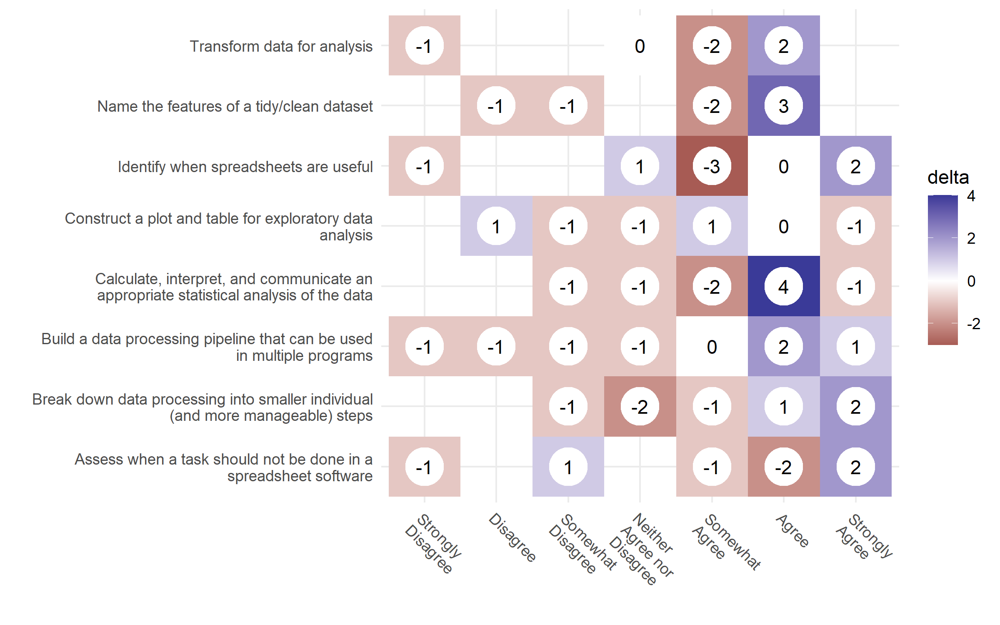
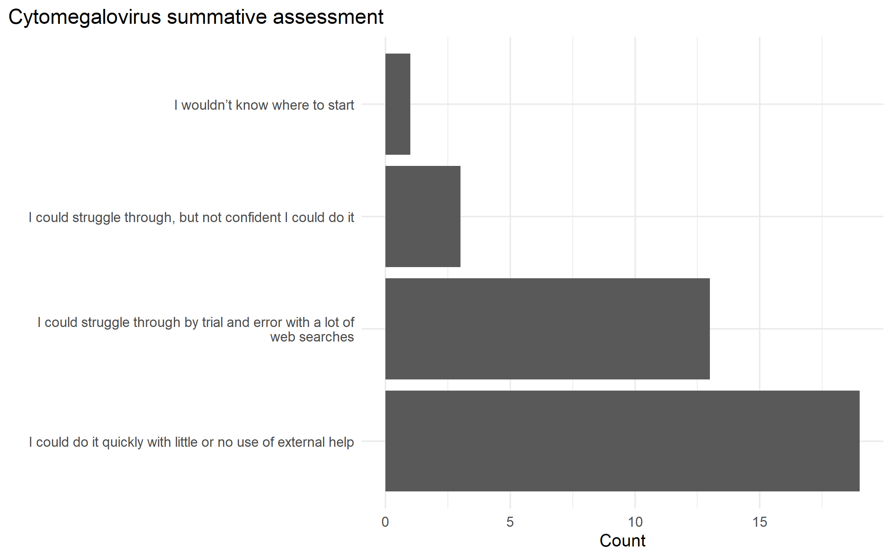

Significance
============

## Importance of the problem to be addressed

2,314 exabytes of new medical data is projected to be produced in 2020 [@stewartHealthcareDataVolume2020].
The sheer volume of data requires the understanding, accessing, managing, and interpreting of data across researchers, clinicians, and patients [@instituteofmedicineusroundtableonvaluescience-drivenhealthcareClinicalDataBasic2010].
By democratizing data science skills for clinicians,
they will be able to better understand their patient population,
better communicate with research teams to improve the outcomes of patients,
and be better advocates for their patients.
However, existing data science learning materials in the medical and biomedical sciences
lack one of the following features:
(1) is community oriented,
(2) has an open creative commons license,
(3) is maintained,
(4) is accessible,
and (5) follows education and pedagogy best practices to target learning objectives.
These are features that would
modernize the biomedical data-resource ecosystem,
promote Findable, Accessible, Interoperable, and Reusable (FAIR) principles,
and enhance the the data science and research workforce in the biomedical sciences.

The Health Information Technology for Economic and Clinical Health (HITECH) Act
included the concept of Electronic Health Records - Meaningful Use (EHR-MU)
which incentivised all medical records to be electronic by 2014.
Currently, in 2020 more than 89% of all hospitals have implemented an EHR system.
While EHR systems have their own data challenges,
the influx of electronic data has called for changes in how clinicians undergo training to meet the challenges of evidenced-based medicine using these data.
By contextualizing and democratizing the data science skills for clinicians we can provide them
more capacity explore and make better use of the data.
Additionally, by empowering the people using and working with better data literacy and data science skills,
we can build the workforce needed to better use and collect the data we need to innovate and progress health care.

Programming courses are generally considered difficult with high dropout rates.
Motivation and mindset are some of the integral roles in learning programming and building life-long learners.
A backward design approach using learner personas for creating lessons help keep teaching focused on objectives and help cater the needs of the learner to the overall learning objectives.
Data science tools are built around "tidy data" principles,
a core data literacy topic describing how the rows and columns of a data set need to be specified for analysis.
Once the lessons are created,
it can be freely shared (e.g., using a CC-0 creative commons license) and improved upon,
but also has the flexibility to be adapted to individual instructor needs.

This proposal seeks to address the following knowledge gaps in the literature:
(1) There are no formal learner personas for the biomedical community and the assessment tools to identify and create learner personas do not exist.
(2) Data science learning materials for the biomedical sciences lack community oriented, open, and maintained lessons targeting learner persona needs grounded in pedagogical practices and theory.
(3) While we know a lot about the teaching and pedagogy of computer science education,
less is known about data literacy education,
and almost nothing is known about data science education.

## Rigor of Prior Research Supporting the Aims

**Aim 1: Identify learner personas in the biomedical sciences by creating and validating learner self-assessment surveys.**

Personas are detailed fictional characters based on well-understood and highly specified data to facilitate user-centered design [@pruittPersonaLifecycleKeeping2006; @zagallo2019through].
Learner personas encompass a learner's general background, prior relevant knowledge, perception of needs, and special considerations [@wilson2019teaching].
These personas can be used along with a backwards lesson design method to keep teaching focused on learning objectives,
and keep assessment materials within the scope of the learning materials [@wilson2019teaching].
In order to identify the learner personas, we adapted questions from
The Carpentries (insert citations),
"How Learning Works" [@ambrose2010learning],
and "Teaching Tech Together" [@wilson2019teaching] and focused on 3 knowledge domains:
programming knowledge, data knowledge, and statistics knowledge.
These the questions were sent out to list serves and
results can be clustered to identify personas using hierarchical clustering [@zagallo2019through].
**The personas created can help future educators in the biomedical sciences teaching data science skills
focus their content so they are relevant to the population and address their needs.
The survey and persona clustering methodology can be adapted and utilized to create data science materials
for other professional domains.**

```{r, echo=FALSE}
dendo_caption <- "Shows the 4 clusters created from the hierarchical clustering using euclidean distance and ward's.
These cluster assignments were then combined with the survey responses to identify the personas.
From left to right: experts, clinicians, students, and academics."
```


```{r dendogram4, fig.cap=dendo_caption, echo=FALSE}
fs::file_copy(here::here("../dissertation-analysis/output/persona/dendogram_4.png"),
              here::here("./figs/"), overwrite = TRUE)
knitr::include_graphics("./figs/dendogram_4.png")
```

Figure \@ref(fig:dendogram4) shows the persona clustering.
The identified clusters were combined with the original survey data to fill in the
each persona's prior relevant knowledge and background.
The perception of needs and special considerations were created to make each persona complete but not based on survey data.
A future qualitative study would be needed to get a more accurate background, need, and special considerations for the personas [@zagallo2019through].

The survey also went though a validation phase, looking at Principle Component Analysis (PCA) and
Exploratory Factor Analysis (EFA) results.
The EFA results were also used to simplify he survey down to 3 question,
one for each of the knowledge domains.

**Aim 2: Create an effective data science for biomedical science curriculum based on best education and pedagogy practices.**

A backwards design approach was used to create the data science curriculum for the biomedical sciences.
This puts the learning objectives, formative and summative assessment questions at the forefront of the lesson material to keep them focused and in the scope of the lesson [@wilson2019teaching].
Learners who want to learn how to perform data analysis, typically, also need to learn data literacy skills to learn how to obtain and manipulate data [@miloInformationLiteracyStatistical2005].
We use tidy data principles as the guiding concept of data literacy [@wickhamTidyData2014] to focus our learning objectives.
Best practices on education and pedagogy dictate we create small focused lessons and reinforce the learning objectives
by creating a series of formative assessments [@wilson2019teaching].
In order to test the content and effectiveness of the materials and its learning objectives,
we use a series of pre-workshop and post-workshop surveys to determine learner's confidence in the learning objectives (carpentries citation).

```{r, echo=FALSE}
lo4_caption <- "Shows the changes from the pre-wokshop and post-workshop responses. The numbers show the differences from the pre-workshop counts, from the post-workshop counts. White (0) means there was a net 0 difference between reponses. Blue represents where more responses went to after the workshop and red represents the number of people who migrated from a particular response after the workshop."
```


```{r lo4, fig.cap=lo4_caption, echo=FALSE}
fs::file_copy(here::here("../dissertation-analysis/output/survey/03-post_workshop/diff-likert-learning_objectives.png"),
              here::here("./figs/"), overwrite = TRUE)

```

A long-term survey will be sent out to respondents to see how their confidence with the same set of learning objectives have changed over 6 months,
to see how learners may have retained and built on the the knowledge from the workshop.
There is a final summative assessment question in both the post-workshop and long-term survey.
**The surveys and learning materials will serve as the first set of community oriented,
open with a creative commons license, accessible, and follows best pedagogical practices.**
Maintainability needs to be accessed over loger periods of time,
but organizations like the carpentries provide a community and mechanism where these materials can be migrated to after
the initial curriculum assessment is complete to find other lesson maintainers in their incubator and lab community lessons.

**Aim 3: Assess the effectiveness of formative assessments in learning learning objectives**

<!--
what are the learning outcomes from CS literature to he ones i'm using.
explaination of divergence happens and why what i'm doing is happening.
and divergence does not dis affect the DS students

frameworrk of appling. e.g., science students in engineering math, even though they're the same topic
-->

Formative assessments are a pedagogical tool instructors use to identify learner's misconceptions [@wilson2019teaching].
In order to reduce the cognitive load on the learners,
various types of assessment questions can be used.
Parsons problems take a block of solution code,
scramble the order of the lines,
and ask the learner to assemble to code back into the correct execution order.
Faded examples provide working code snippets with some amount of the code "blanked out".
Parson's problems allow the learner to focus on the overall steps and flow of the thought process,
and faded examples focus the learner's attention to a specific part of the code.
Both provide some kind of scaffolding mechanism for the student, so they are not writing code from scratch.
**These assessments will look for time to complete and solution correctness as a measure of
meeting the learning objectives.
It will also be the first set of data science specific formative assessments focused on data literacy topics,
and not basic programming concepts in the computer science literature.**
By keeping both the learning materials from Aim 2, and the assessment tools focused on learning objectives,
we hope that these will lead to better learning outcomes in the learners.

```{r, echo=FALSE}
post_summative_assessment_caption <- "Shows the responses to a summative assessment question at the end of the workshop. The question asked the learners about a learner's comfort in loading a tabulated dataset, tidy it up, and perform a small analysis."
```


```{r post_summative_assessment, fig.cap=post_summative_assessment_caption, echo=FALSE}
fs::file_copy(here::here("../dissertation-analysis/output/survey/03-post_workshop/Q5.1.png"),
              here::here("./figs/"), overwrite = TRUE)

```
