Approach
========

## Human Subject Research

We have an IRB (#20-537) that outlines the minimal risk from the survey participants,
and have a data plan for storage, anonymization, and sharing.

## Introduction

While there is a lot of literature and studies on computer science education,
very little is known about data literacy education, and even less on data science education.
Since data science skills inherently involve programming,
there are synergies between the educational and pedadogical approach to teaching data science,
however, little is known about what are key concepts and learning objectives that need to be taught,
and the effectiveness of those learning objectives.

Our goal is to Create community-oriented, open, maintained, and focused data science learning materials for the medical
and biomedical sciences.
To this end, in Aim 1, we lay the ground work for understanding potential learners by identifying and creating learner personas,
fictional characters that represent a typical type of learner,
by creating and validating a set of self-assessment surveys.
In Aims 2 and 3, we create and assess the effectiveness of the learning materials, the workshop that teaches the materials,
and the implementation of formative and summative assessment questions to see if learning objectives are met.

Our long-term goal is to
bridge the skills gap between medical practitioners and domain experts in the biomedical sciences with the
analysts, researchers, and data scientists
to make better use of data (storage, FAIR, stewardship) in data science teams
by creating and bolstering a computational community of practice that can enhance workforce development,
modernize the data ecosystem, work with data science tools for sustainable and open science.


## Hypothesis
Data science tools are built around inputs that are defined by tidy data principles.
Spreadsheet programs make it easy to treat data sets as a visualization,
which make the data less flexible for multiple uses.
It is possible programming may not be incorporated by learners,
but these materials may help curate better datasets that can be used in data science teams.
<b>
Our central hypothesis is that learning materials with an eye towards
the learner and tidy data principles is an effective way to teach
the data science and data literacy skills that will help learners
incorporate programming and data science skills from their spreadsheet workflows.
</b>
To address these critical gaps in knowledge,
we will create a set of surveys that will inform us of the potential learners and assess the effectiveness of the learning
materials.
Lesson efficacy will be tested against learning objectives.

## Experimental Design

### Aim 1: Identify learner personas in the biomedical sciences by creating and validating learner self-assessment surveys {-}

Assessing the prior knowledge of potential learners in the medical and biomedical sciences who are interested in
learning data science skills by creating a learner self-assessment where participants rate their own
comfort in data, statistics, and programming skills.

#### Working Hypothesis {-}

We hypothesize that learners will fall across the 3 main groups of the Dreyfus model of  skill acquisition: novice, intermediate, and expert.
These groups will be distinguishable based on their own comfort in 3 domains of data science (data, programming, and statistics knowledge),
To test this we will create a learner self-assessment survey.
The survey will cover data, programming, and statistics knowledge and will have at least 2 questions asking about the same underlying concept for internal consistency.
Results from the survey along with demographic information will be combined to create the personas.
These personas will be used to inform the learning objectives for lesson materials.

#### Preliminary Data for Aim 1 {-}

In preliminary studies, we found that we were able to cluster the respondents into 4 clusters using hierarchical clustering
with euclidean distance and Ward's method.
We then combined these clusters with the occupation question to come up with the 4 learner personas:
clinicians (novice), academics (intermediate), students (intermediate), and programmers (experts).

##### 1.1: Learner self-assessment survey asking questions about prior programming, statistics, and data knowledge will be used to create learner personas {-}

We will send out self-assessment surveys to various medical and biomedical groups around the Virginia Tech campus.
We collected preliminary data over the summer of 2020 and
had 51 participants consented to the survey.
Figure \@ref(fig:surveySelfGroupedDemographics) shows the grouped distribution of responses
to the occupation demographic question (this is a select-all-that-apply question).

```{r surveySelfGroupedDemographics, echo=FALSE, echo=FALSE, out.width= "50%", out.extra='style="float:left; padding:10px"'}
fs::file_copy(here::here("../dissertation-analysis/", "./output", "survey", "01-self_assessment", "grouped_demographics.png"),
              here::here("./figs/"), overwrite = TRUE)
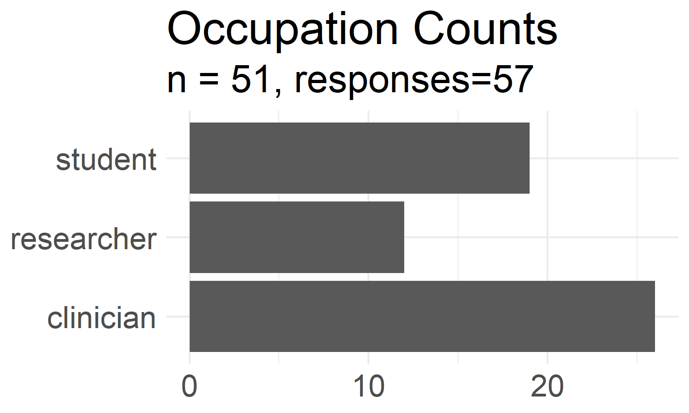
```

In general we found that the overall group has low programming skills with basic data analysis skills primarily using Excel.
IN general, they do not understand how data pipelines are created, and do not now how data can be processed into different "shapes" for analysis.
These results are summarized in Figures 
\@ref(fig:surveySelfQ31),
\@ref(fig:surveySelfQ41),
\@ref(fig:surveySelfQ42),
\@ref(fig:surveySelfQ44),
\@ref(fig:surveySelfQ52), and
\@ref(fig:surveySelfQ64).

<br>

```{r surveySelfQ31, echo=FALSE, out.width= "50%", out.extra='style="float:left; padding:10px"'}
fs::file_copy(here::here("../dissertation-analysis/", "./output", "survey", "01-self_assessment", "Q3.1.png"),
              here::here("./figs/"), overwrite = TRUE)
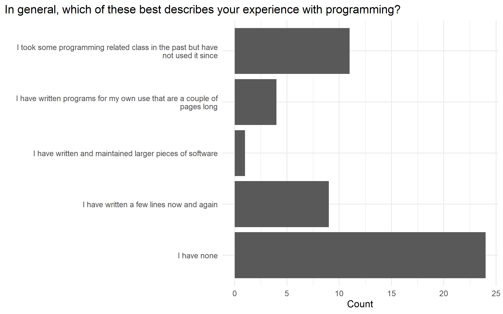
```

```{r surveySelfQ41, echo=FALSE, out.width= "50%", out.extra='style="float:right; padding:10px"'}
fs::file_copy(here::here("../dissertation-analysis/", "./output", "survey", "01-self_assessment", "Q4.1.png"),
              here::here("./figs/"), overwrite = TRUE)
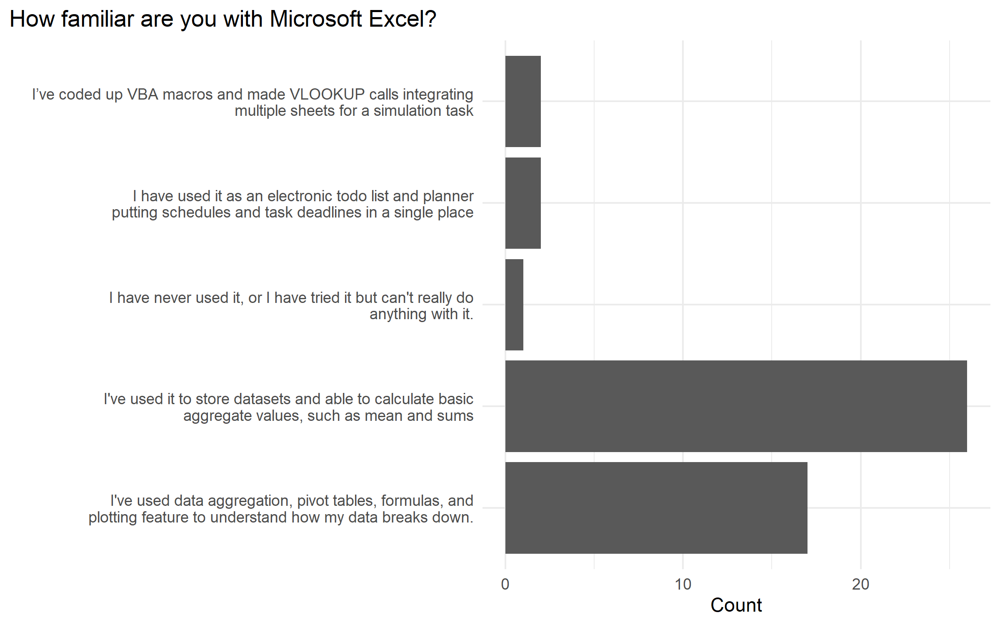
```

```{r surveySelfQ42, echo=FALSE, out.width= "50%", out.extra='style="float:left; padding:10px"'}
fs::file_copy(here::here("../dissertation-analysis/", "./output", "survey", "01-self_assessment", "Q4.2.png"),
              here::here("./figs/"), overwrite = TRUE)
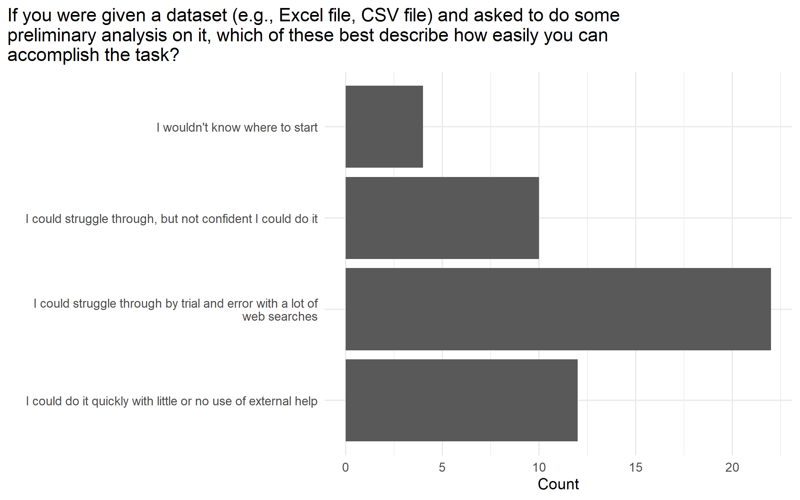
```

```{r surveySelfQ44, echo=FALSE, out.width= "50%", out.extra='style="float:right; padding:10px"'}
fs::file_copy(here::here("../dissertation-analysis/", "./output", "survey", "01-self_assessment", "Q4.4.png"),
              here::here("./figs/"), overwrite = TRUE)
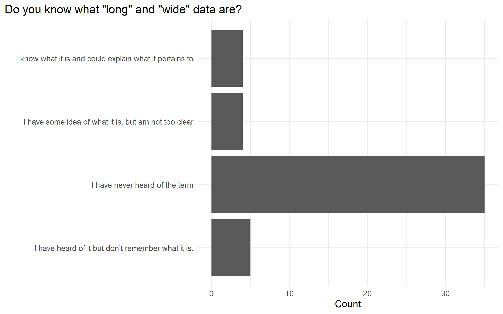
```

```{r surveySelfQ52, echo=FALSE, out.width= "50%", out.extra='style="float:left; padding:10px"'}
fs::file_copy(here::here("../dissertation-analysis/", "./output", "survey", "01-self_assessment", "Q5.2.png"),
              here::here("./figs/"), overwrite = TRUE)
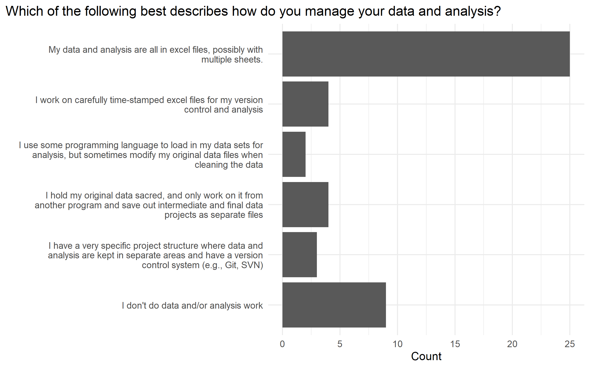
```

```{r surveySelfQ64, echo=FALSE, out.width= "50%", out.extra='style="float:right; padding:10px"'}
fs::file_copy(here::here("../dissertation-analysis/", "./output", "survey", "01-self_assessment", "Q6.4.png"),
              here::here("./figs/"), overwrite = TRUE)
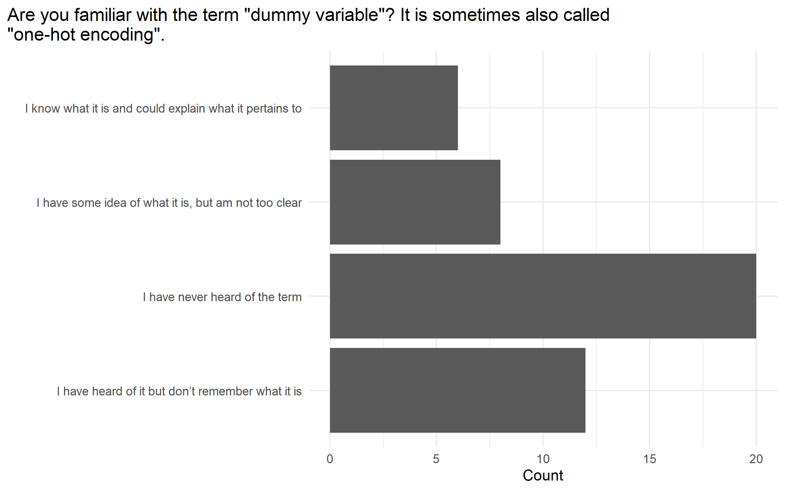
```

The survey we created also asked a summary likert scale table of questions (Figure \@ref(fig:surveySelfLikert)).
These results confirm the overall findings where respondents typically do not use a programming language in their work,
and are indifferent towards programming in doing analysis.
They did report that having access to the original raw data is important to repeat an analysis.
This let us conclude that
<b>
there is a lack of knowledge in the data literacy fundamentals where data can be transformed from user-friendly data curation formats to
analysis-friendly formats in multiple pipelineing steps.
</b>


```{r surveySelfLikert, echo=FALSE}
fs::file_copy(here::here("../dissertation-analysis/", "./output", "survey", "01-self_assessment", "likert.png"),
              here::here("./figs/"), overwrite = TRUE)
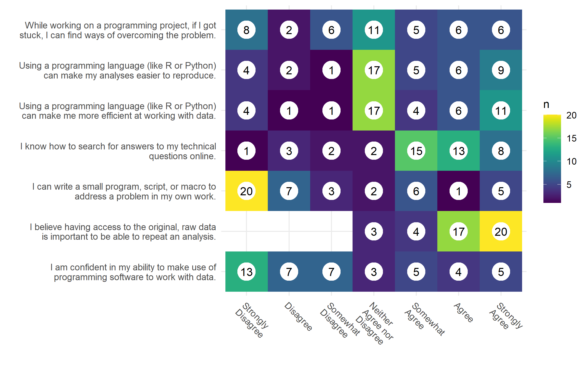
```

##### 1.2: Validate learner self-assessment survey {-}

The survey was designed with the questions in duplicate for internal validity, i.e., each construct was asked in 2 separate questions.

```{r personaPCACumProp, echo=FALSE, out.width= "50%", out.extra='style="float:left; padding:10px"'}
fs::file_copy(here::here("../dissertation-analysis/", "./output", "persona", "pca_cum_prop.png"),
              here::here("./figs/"), overwrite = TRUE)
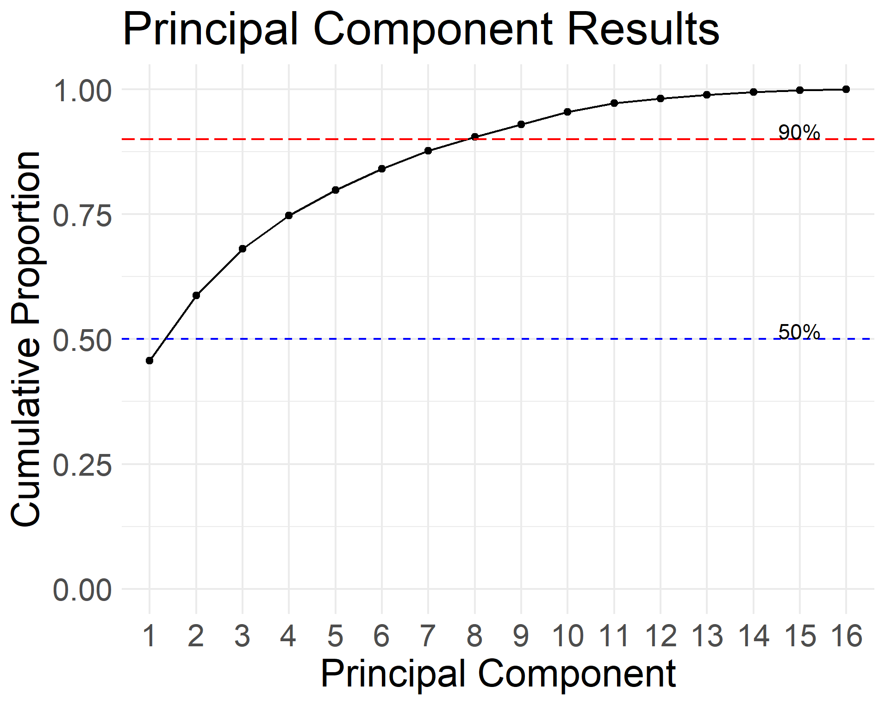
```

Figure \@ref(fig:personaPCACumProp) shows how half of the questions (8 out of 16) account for more than 90% of the variance in PCA,
with the first component accounting for 46% and 3 components accounting for 68%.
Since our survey was designed using 3 main constructs: programming, statistics, and data knowledge, these results show that the survey
was well designed and has internal consistency among the respondents.

We also conducted an exploratory factor analysis on our preliminary data,
and used 3 factors, one for each latent variable.
The question loadings also followed the constructs in the survey,
suggesting the validity of the survey.
We would need to expand the survey to more participants to show it's external validity.
Given the preliminary data, we propose to perform more validation checks by increasing the sample size.
We will be able to calculate the Cohen's kappa coefficient to measure inter-rater reliability and
the larger sample size will improve the external validity of the survey.

##### 1.3: Personas will encompass a student’s prior knowledge using survey data. General background, perception of needs, and special considerations will be added to make each learner persona a complete character {-}

We used hierarchical clustering with euclidean distance and ward's method
on our preliminary data to create the learner personas (Figure \@ref(fig:personaHclust4)).

```{r personaHclust4, echo=FALSE, out.width= "50%", out.extra='style="float:left; padding:10px"'}
fs::file_copy(here::here("../dissertation-analysis/", "./output", "persona", "dendogram_4.png"),
              here::here("./figs/"), overwrite = TRUE)
knitr::include_graphics("./figs/dendogram_4.png")
```

This approach is validated from preliminary results showing the 4 learner personas from our data.
We combined these groupings back with the survey occupation demographics to create the
relevant prior knowledge portion of learner personas.

Our preliminary data gave us 4 personas that map on to the different stages of the
Dreyfus model of skill acquisition:
clinicians (novice), academics (intermediate), students (intermediate), and programmers (experts).

```{r surveyHClust4Likert, echo=FALSE}
fs::file_copy(here::here("../dissertation-analysis/", "./output", "persona", "group_descriptives_4", "likert_prop.png"),
              here::here("./figs/persona_4_likert_prop.png"), overwrite = TRUE)
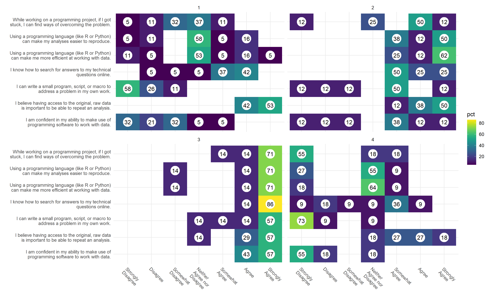
```

#### Anticipated results and their impact {-}

Preliminary results show that we are able to validate use the learner self-assessment survey and use the survey results
to create learner personas.
This gives us an overview of the audience we would potentially teach in the medical and biomedical sciences.
Since the final step of persona creation combines the demographic information,
the base survey questions can be used across other domains, not just the one we are studying.
This potentially gives us a tool to accurately gauge data science learners to better create learning materials for their needs.

#### Potential pitfalls, alternative approaches, and future directions {-}

The data collection process is based on surveys.
This inherenctly means we will have reporting and response bias.
The demographic breakdown in our learner self-assessment was fairly diverse
(Figure \@ref(fig:surveySelfGroupedDemographics)),
but our preliminary data was only collected from Virginia Tech students and faculty from biomedcially relevant
listservs.
Future directions would include increasing the survey pool to get a better representation of potential learners.
A larger survey pool would also help with the survey validation by potentially surveying a more diverse
population and also increase our N for the analysis.


### Aim 2: Create an effective data science for biomedical science curriculum based on best education and pedagogy practices {-}

#### Working Hypothesis {-}

We hypothesize that a data science curriculum focused around data literacy principles from working with spreadsheet data
will be the most relevant to our learners.
We also hypothesize that the learning objectives we create will give the learner's confidence in performing their own
data analysis after going through the materials.
By catering to the learner's needs, and teaching the data literacy fundamentals,
learners will be more motivated to continue learning on their own.
To test this hypothesis we will create a set of pre-workshop, post-workshop, and long-term workshop surveys.
Since this is an observational study, we will use the learner's confidence on their ability to accomplish a task
as a proxy for meeting learning objectives.
There will be a set of self assessment and learning objective tasks that will be asked across all surveys to measure
differences in response longitudinally.

#### Preliminary Data for Aim 2 {-}

A data science curriculum based on learner personas was created and used to teach a set of workshops.
Preliminary data collected before and after the workshop compare a learner's confidence of meeting learning objectives,
and show that the learners are more confident in their skills and learning objectives
(Figure \@ref(fig:surveyPostLikertDiffSelfAssessment) and \@ref(fig:surveyPostLikertDiffLO))

```{r surveyPostLikertDiffSelfAssessment, echo=FALSE}
fs::file_copy(here::here("../dissertation-analysis/", "./output", "survey", "03-post_workshop", "diff-likert-self_assessment.png"),
              here::here("./figs/diff-likert-self_assessment.png"), overwrite = TRUE)
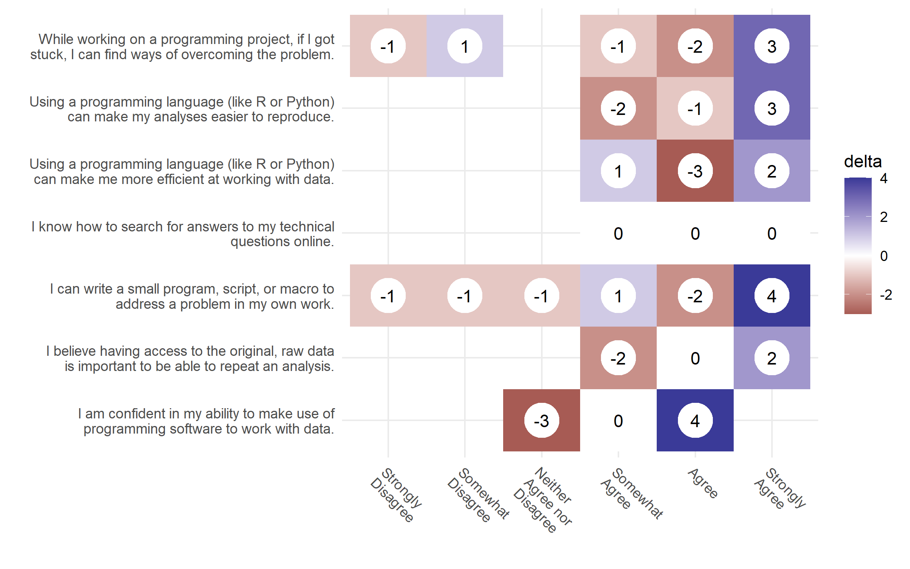
```

```{r surveyPostLikertDiffLO, echo=FALSE}
fs::file_copy(here::here("../dissertation-analysis/", "./output", "survey", "03-post_workshop", "diff-likert-learning_objectives.png"),
              here::here("./figs/diff-likert-learning_objectives.png"), overwrite = TRUE)
knitr::include_graphics("./figs/diff-likert-learning_objectives.png")
```

##### 2.1: Learning objectives focused around core data literacy principles in the data science pipeline will be used for each lesson module {-}

In this subaim we will create a data science curriculum that ties together data literacy and data management pipelines
with the skills used in data science.
Our preliminary learner personas guided us to use spreadsheet programs (e.g., Excel, LibreOffice, Google Sheets, etc)
as the first lesson module to orient the learners and
use "tidy data principles" as the underlying theme to transform data.
Preliminary data and a survey of available lesson materials show that there is a gap in available teaching materials
that link data literacy concepts of data management and processing with other steps in the data science process.


##### 2.2 Lesson content follow best educational and pedagogical best practices {-}

The lesson materials created will follow the best educational and pedagogical best practices for learning programming.
To account for the different learning styles, a book and slide deck format of the materials will be created.
Workshops from the materials will also be recorded with live captioning and uploaded in the public domain (e.g., YouTube).
Learning objectives following Bloom's taxamony will be created for each lesson module.
Previous studies have shown that programming concepts should be in shorter blocks of time,
with small formative assessment exercises used to assess learning objectives.
We are working on lesson materials that can be roughly taught in 45 to 50 minute increments,
leaving time for a break and formative assessment.
This time block also coincides with the typical "period" of a classroom session so the materials
can be adapted for a broader educational purpose.

##### 2.3 Assess the effectiveness of learning materials {-}

In this subaim, we will assess how effective the lesson materials and its learning objectives are by
comparing results from a pre-workshop and post-workshop survey.
Survey participants will have a unique identifier that can be used to track individual differences
and be aggregated to look at the overall effect changes before and after the workshop.
Preliminary data shows that learner's confidence in various tasks and learning objectives do improve after the workshop.
A long-term survey will be sent out to workshop participants to see retention of learning objectives,
if learners found the workshop useful, and if learners have continued to learn and work on their own projects.

#### Anticipated results and their impact {-}

We anticipate that a lesson curriculum that incorporates existing tools and prior knowledge of spreadsheets
will help learners fill in gaps of their data literacy mental model when working with data in data science projects.
By focusing on data literacy concepts, we are building a curriculum that promotes FAIR principles.
This aim will create a tested learning curriculum that can be adapted into many teaching and learning formats.
The book can be done as supplemental reading or as self-paced reading,
the slides provide major points that can be used in a lecture or presentation,
and recordings are provided to learners either as a reference or material for new learners who cannot attend a live
workshop setting.
These materials lay the groundwork for a community-oriented, open, accessible, and pedagogically sound curriculum
that can be used to enhance the data science and research workforce in the biomedical sciences and
adapted to other domains.

#### Potential pitfalls, alternative approaches, and future directions {-}

Our preliminary data shows more reporting bias than our learner self-assessment survey.
Most of the respondents from the workshop surveys are students,
and not from the other occupation groups.
This problem can be remedied by conducting more workshops to collect more data which may offset the bias.
Our surveys mainly measure the learner's confidence towards a learning objective as a proxy for a summative assessment.
These results are self-reported and may show response bias.


### Aim 3: Assess the effectiveness of formative assessments in learning learning objectives {-}

#### Working Hypothesis {-}

We hypothesize that formative assessments with targeted and informative feedback about incorrect solutions,
will allow learners to complete formative and summative assessment questions with a higher rate of success.
We also hypothesize that guiding learners with parsons problems and faded in formative feedback exercises
will help them solve summative feedback questions faster.

#### Preliminary Data for Aim 3 {-}

Our hypothesis is based on computer science education literature that uses different question types
for formative assessment questions to aid in learning content.
These question types (faded examples and parson's problems) are used in lieu of a blank box where the learner's
write code from scratch becuase it lowers the cognitive load of the learner's and allows them to focus
on the key aspect off the coding exercise, instead of wresting with the syntax of the code.

##### 3.1: Implement an experiment for conducting formative and summative assessment question types {-}

The `shinysurveys` R package (https://github.com/jdtrat/shinysurveys) provides the framework needed to create
and administer an experimental study that can be used to collect response data from user submitted code.
It leverages the `learnr` R package that allows instructors to create lesson materials with
an input field that can execute code.
The `gradethis` library can be used to check R and Python code for the correct result to provide feedback to the student.
`gradethis` also has the ability too check the syntax of the code itself to point to an exact part of the code that is incorrect, instead of giving a programming error or non-meaningful "incorrect" message.
`shinysurveys` can be used in conjunction with the tools and techniques from "Data Science in a Box" (https://datasciencebox.org/)
to collect the responses from the student for analysis using the `learnrhash` library (https://github.com/rundel/learnrhash/).

##### 3.2: Assess the effectiveness of targeted feedback in autograding systems used in formative and summative feedback {-}

In this aim we hope to show an improvement in the success rate of assessment questions when
targeted feedback about the incorrect solution is given by the learner.
We know feedback is an important step in the learning process,
but it is not possible to give real-time feedback during many assessment questions,
especially when teaching at scale.
We hope to take the results from our implementation of `shinysurveys` and "Data Science in a Box"
to collect learner assessment performance and compare the differences between learners
who are givin differnt types of assessment questions from those who are simply given an empty box to type code
with and without informative feedback from the autograder.

#### Anticipated results and their impact {-}

We are expecting to see an improvement in speed and correct responses in students' final summative assessment
when  they are givien who are given question types other than
an empty text box in the formative assessment.
While these question types are used in computer science education literature,
these techniques have not been studied yet to show whether adding the additional cognitive load
of completing a data related task helps with learning the materials.
We anticipate that these results will give future educators the types of questions that can be used
for foramtive assessments when teaching.

#### Potential pitfalls, alternative approaches, and future directions {-}

Trying to find the correct population of participants to use in this study will be challenging.
Since the study will aim to only teach a single portion of the overall lesson materials,
it's possible that the amount of information used for this aim will be either too simple or too complex for participants
given the time constraints.
If that is the case, we may resort to only looking at the amount of time to complete a solution,
rather than comparing if the different groups are answering the question correctly.
This aim will provide the basis of incorporating a formative and summative assessment system
that can be used in a live teaching enviornment so the instrcutor can get feedback about
topics and concepts that the learners are grasping.
